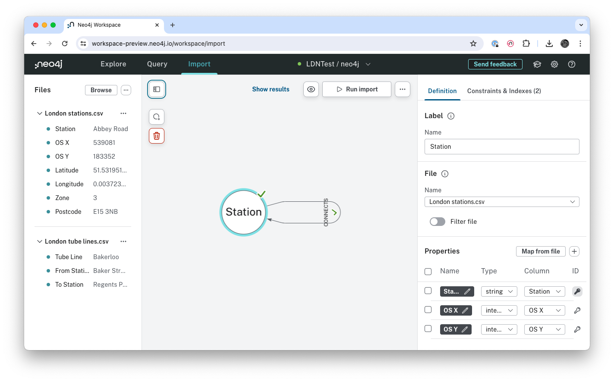
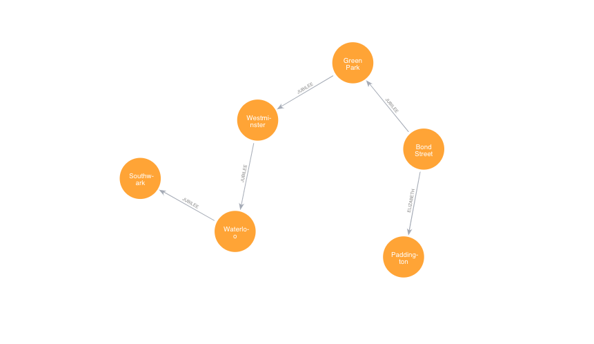

## Updated LDN import

Uses updated source files and the Neo4j Workspace importer.

 

### Post import scripts

Replaces the "CONNECTS" Relationship with the name of the line - also updates the text to upper case to match best practices

~~~
MATCH (a)-[r]->(b)
CALL {
  WITH a, b, r
  CALL apoc.create.relationship(a, toUpper(r.TubeLine), properties(r), b) YIELD rel
  RETURN rel
}
DELETE r
~~~

Example query

~~~
MATCH (start:Station {Station: "Paddington"})
MATCH (end:Station {Station: "Southwark"})
MATCH path = allShortestPaths((start)-[*..99]-(end))
RETURN path
~~~

Now the results show the Elizabeth Line

 