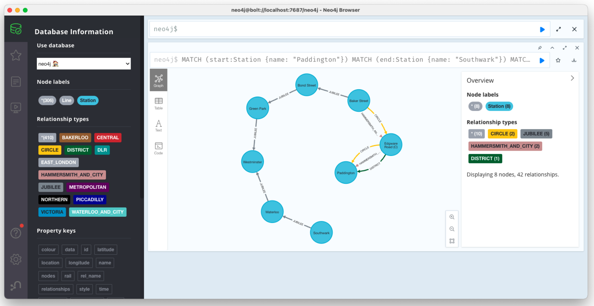

# London Underground Sample Queries

~~~
MATCH (start:Station {name: "Paddington"})
MATCH (end:Station {name: "Southwark"})
MATCH path = allShortestPaths((start)-[*..99]-(end))
RETURN path
~~~

 
_Example results within the Neo4j Browser_

 
_Example results within the Neo4j Bloom_

